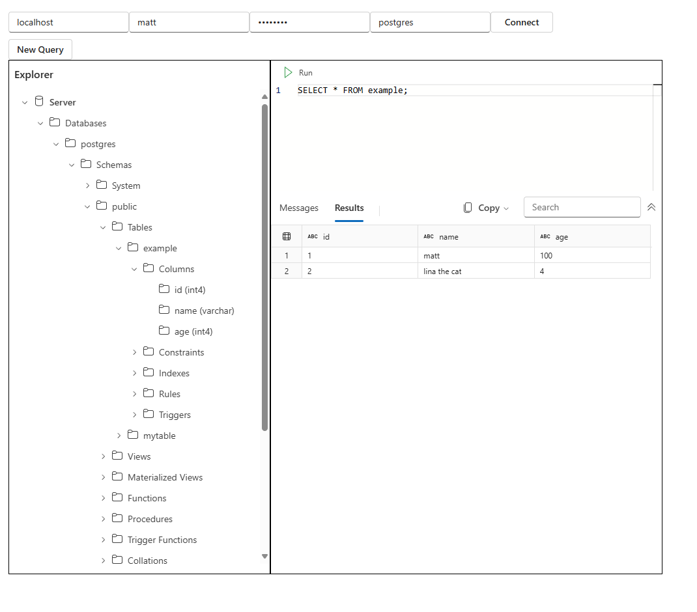

# Fabric UX Controls Proof of Concept

This project is a rough implmentation of the Trident Warehouse UX (aka Fabric)
Controls in a React project. The goal is to demonstrate how to use these UI
components in outside of a Trident extension host, connecting to an arbitrary
data source.

For the purposes of this project, database nodes, SQL queries, and their result
sets are all executed against an in-progress branch of the PG Tools Service.

## Context

There is some minimal but useful documentation on the Trident Warehouse UX Wiki:
<https://dev.azure.com/powerbi/Trident/_wiki/wikis/Trident.wiki/48073/TridentWarehouse-UX>

The controls can be accessed from the Artifact feed here:
<https://dev.azure.com/powerbi/Trident/_artifacts/feed/PowerBIClients/Npm/@trident%2Frelational-db-ux/overview/2025.1.4>

And you may need to join this Access Package to be able to authenticate against the feed:
<https://myaccess.microsoft.com/@microsoft.onmicrosoft.com#/access-packages/24178c0c-7bb8-4c5a-aabe-da6a8615ec75>

## Getting Started

### Run PG Tools Service

The PGTS provides an HTTP wrapper around the existing RPC API. This project expects the service to be running at `http://localhost:8080`.

Build the PG Tools Service project at this branch, and install all the dependencies as per that project's README.
<https://github.com/microsoft/pgtoolsservice/tree/personal/chkraw/windows-build-changes>


```console
python ossdbtoolsservice_main.py \
    --enable-remote-debugging
    --enable-web-server
    --listen-port 8080
```

### PostgreSQL Database

Make sure an PG database is running at a location accessible to your machine, you'll need to provide credentials through this app.

To get started, run the following commands from the root of this POC project:

```bash
yarn install # if you get auth errors, check the .npmrc file and the feed instruction above
yarn dev
```


